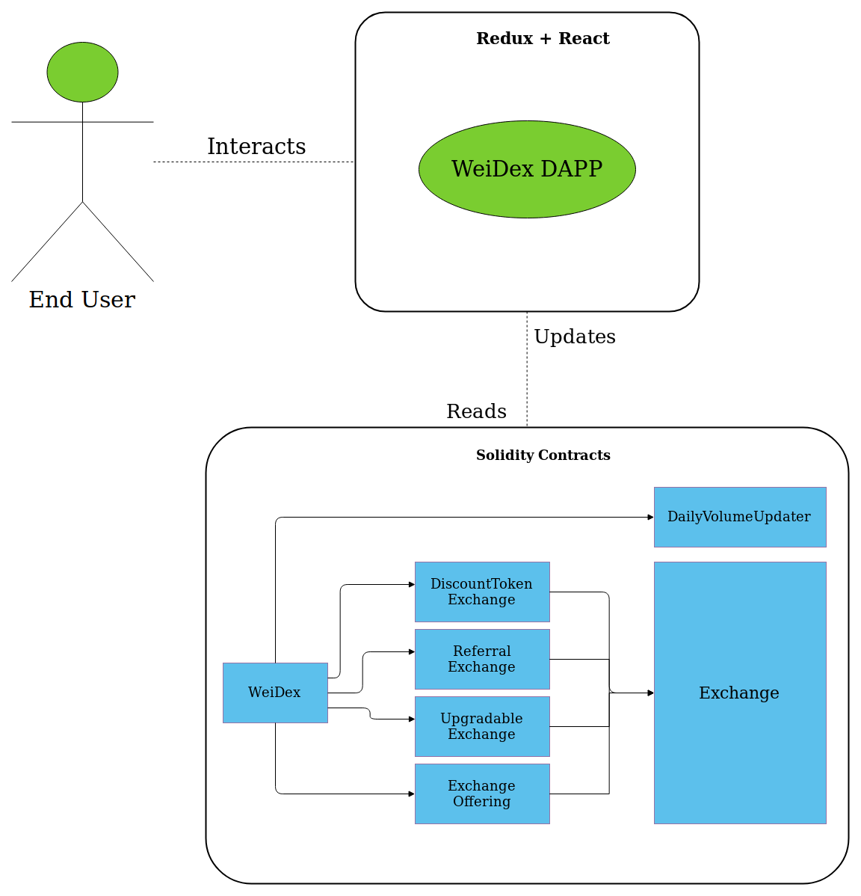

weiDex API
==========================

Architecture
------------
WeiDex uses a numerous Ethereum Smart Contracts (currently written in Solidity),
splitting the logic into a separated modules.
Thus, modules can be upgraded separately. Modularity is achieved through inheritance for now.
The Upgradability is achieved through a separate Smart Contract
and users could choose to use the new version for himself or stick with the old one. The detailed explanation about the upgrade process will be provided soon.

Contract Interactions
---------------------
This section contains information on how to consume the Smart Contract functions to automate your tradings.

.. toctree::
   :maxdepth: 2

   blockchain/deposit
   blockchain/withdraw
   blockchain/take-order
   blockchain/cancel-order

HTTP API
--------
This repository contains instructions on how to consume the WeiDex API.
The WeiDex API is under **active development** and some methods may be **deprecated or modified**.

.. toctree::
   :maxdepth: 2

   backend/getInfo